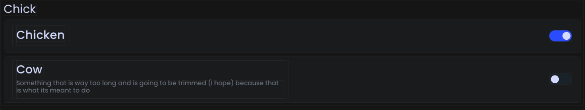

# Switch Option

<figure><figcaption><p>An example of what the switch looks like in-game, toggled both on and off.</p></figcaption></figure>

## Example



```java
@Switch(
    title = "My Switch",
    description = "This is my switch", // Recommended, default = ""
    icon = "/my_switch.svg", // Optional, default = ""
    category = "Switches", // Recommended, default = "General"
    subcategory = "General" // Recommended, default = "General"
)
public static boolean mySwitch = false;
```



<pre class="language-kotlin"><code class="lang-kotlin"><strong>var mySwitch: Boolean by switch(
</strong>    name = "My Switch",
    def = false, // Sets option's default value. Recommended, default = true
    description = "This is my switch", // Recommended, default = ""
    icon = "/my_switch.svg", // Optional, default = ""
    category = "Switches", // Recommended, default = "General"
    subcategory = "General" // Recommended, default = "General"
)
</code></pre>


