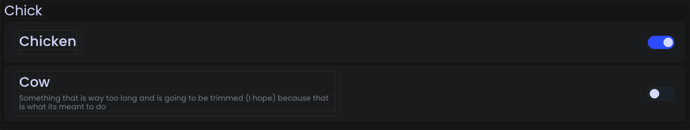

# Switch Option

<figure><figcaption><p>An example of what the switch looks like in-game, toggled both on and off.</p></figcaption></figure>

## Example



```java
@Switch(
    title = "My Switch",
    titleKey = "", // Sets the options tile translation key, default = ""
    description = "This is my switch", // Sets the options description, default = ""
    descriptionKey = "", // Sets the options description translation key, default = ""
    icon = "/my_switch.svg", // Sets the icon used for the option, default = ""
    category = "Switches", // Sets the options category, default = "General"
    categoryKey = "", // Sets the categories translation key, default = ""
    subcategory = "General", // Sets the options subcategory, default = "General"
    subcategoryKey = "" // Sets the options subcategory translation key, default = ""
)
public static boolean mySwitch = false;
```



```kotlin
var mySwitch: Boolean by switch(
    name = "My Switch",
    def = true, // Default value, required
    nameKey = null, // Sets the options tile translation key, default = null
    description = "This is my switch", // Sets the options description, default = null
    descriptionKey = null, // Sets the options description translation key, default = null
    icon = "/my_switch.svg", // Sets the icon used for the option, default = null
    category = "Switches", // Sets the options category, default = "General"
    categoryKey = null, // Sets the categories translation key, default = null
    subcategory = "General", // Sets the options subcategory, default = "General"
    subcategoryKey = null // Sets the options subcategory translation key, default = null
)
```


