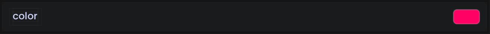

# Color Option

<figure><figcaption><p>An example of what the color picker option looks like in-game.</p></figcaption></figure>

## Example



```java
@Color(
    title = "My Color",
    description = "This is my color", // Recommended, default = ""
    icon = "/my_color.svg", // Optional, default = ""
    category = "Colors", // Recommended, default = "General"
    subcategory = "General", // Recommended, default = "General"
    alpha = true // Optional, default = true
)
public static PolyColor myColor = PolyColor.WHITE;
```



```kotlin
var myColor: PolyColor by color(
    name = "My Color",
    def = PolyColor.WHITE, // Sets option's default value. Recommended, default = PolyColor.WHITE
    description = "This is my color", // Recommended, default = ""
    icon = "/my_color.svg", // Optional, default = ""
    category = "Colors", // Recommended, default = "General"
    subcategory = "General", // Recommended, default = "General"
    alpha = true // Optional, default = true
)
```


