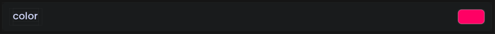

# Color Option

<figure><figcaption><p>An example of what the color picker option looks like in-game.</p></figcaption></figure>

## Example



```java
@Color(
    title = "My Color",
    titleKey = "", // Sets the options tile translation key, default = ""
    description = "", // Sets the options description, default = ""
    descriptionKey = "", // Sets the options description translation key, default = ""
    icon = "/my_color.svg", // Sets the icon used for the option, default = ""
    category = "Colors", // Sets the options category, default = "General"
    categoryKey = "", // Sets the categories translation key, default = ""
    subcategory = "General", // Sets the options subcategory, default = "General"
    subcategoryKey = "", // Sets the options subcategory translation key, default = ""
    alpha = true // Optional, default = true
)
public static PolyColor myColor = PolyColor.WHITE;
```



```kotlin
var myColor: PolyColor by color(
    name = "My Color",
    def = PolyColor.WHITE, // Sets option's default value. Recommended, default = PolyColor.WHITE
    alpha = true, // Allows alpha on the color, default = true
    nameKey = null, // Sets the options tile translation key, default = null
    description = null, // Sets the options description, default = null
    descriptionKey = null, // Sets the options description translation key, default = null
    icon = null, // Sets the icon used for the option, default = null
    category = "General", // Sets the options category, default = "General"
    categoryKey = null, // Sets the categories translation key, default = null
    subcategory = "General", // Sets the options subcategory, default = "General"
    subcategoryKey = null, // Sets the options subcategory translation key, default = null
)
```


