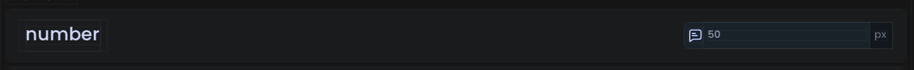

# Number Option

<figure><figcaption><p>An example of what the number option looks like in-game.</p></figcaption></figure>

## Example



```java
@Number(
    title = "My Number",
    description = "This is my number", // Recommended, default = ""
    icon = "/my_number.svg", // Optional, default = ""
    category = "Numbers", // Recommended, default = "General"
    subcategory = "General", // Recommended, default = "General"
    unit = "ms", // Optional, default = ""
    min = 0f, // Recommended, default = -10f
    max = 100f, // Recommended, default = 100f
    placeholder = "Percent..." // Optional, default = "oneconfig.numberinput.placeholder"
)
public static float myNumber = 0f;
```



```kotlin
var myNumber: Float by number(
    title = "My Number",
    def = 0f, // Sets option's default value. Recommended, default = 0f
    description = "This is my switch", // Recommended, default = ""
    icon = "/my_switch.svg", // Optional, default = ""
    category = "Switches", // Recommended, default = "General"
    subcategory = "General", // Recommended, default = "General"
    unit = "ms", // Optional, default = ""
    min = 0f, // Recommended, default = = -10f
    max = 100f, // Recommended, default = 100f
    placeholder = "Percent..." // Optional, default = "oneconfig.numberinput.placeholder"
)
```




Your field can be typed with any subtype of `Number`.

