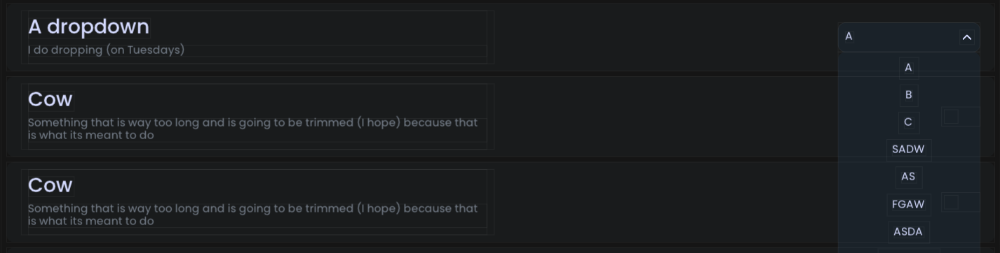

# Dropdown Option

<figure><figcaption><p>An example of what the dropdown looks like in-game.</p></figcaption></figure>

<figure><figcaption><p>An example of what the dropdown looks like in-game when it is expanded.</p></figcaption></figure>

## Example

## TODO: Redo Kotlin example with Kotlin DSL for enumerables and dropdowns

### Using an integer index



```java
@Dropdown(
    title = "My Dropdown",
    description = "This is my dropdown", // Recommended, default = ""
    icon = "/my_dropdown.svg", // Optional, default = ""
    category = "Dropdowns", // Recommended, default = "General"
    subcategory = "General" // Recommended, default = "General"
    options = { "HELLO", "WORLD", "ONECONFIG" } // Recommended, default = {}
)
public static int myDropdown = 0; // 0 = "HELLO"
```



```kotlin
@Dropdown(
    title = "My Dropdown",
    description = "This is my dropdown", // Recommended, default = ""
    icon = "/my_dropdown.svg", // Optional, default = ""
    category = "Dropdowns", // Recommended, default = "General"
    subcategory = "General" // Recommended, default = "General"
    options = ["HELLO", "WORLD", "ONECONFIG"] // Recommended, default = []
)
var myDropdown = 0 // 0 = "HELLO"
```



### Using a custom enum class



```java
public enum MyDropdownOptions {
    HELLO,
    WORLD,
    ONECONFIG;
}

@Dropdown(
    title = "My Dropdown",
    description = "This is my dropdown", // Recommended, default = ""
    icon = "/my_dropdown.svg", // Optional, default = ""
    category = "Dropdowns", // Recommended, default = "General"
    subcategory = "General" // Recommended, default = "General"
    // We can't use the options field when using an enum.
)
public static MyDropdownOptions myDropdown = MyDropdownOptions.HELLO;
```



```kotlin
enum class MyDropdownOptions {
    HELLO,
    WORLD,
    ONECONFIG
}

@Dropdown(
    title = "My Dropdown",
    description = "This is my dropdown", // Recommended, default = ""
    icon = "/my_dropdown.svg", // Optional, default = ""
    category = "Dropdowns", // Recommended, default = "General"
    subcategory = "General" // Recommended, default = "General"
    // We can't use the options field when using an enum.
)
var myDropdown = MyDropdownOptions.HELLO
```


