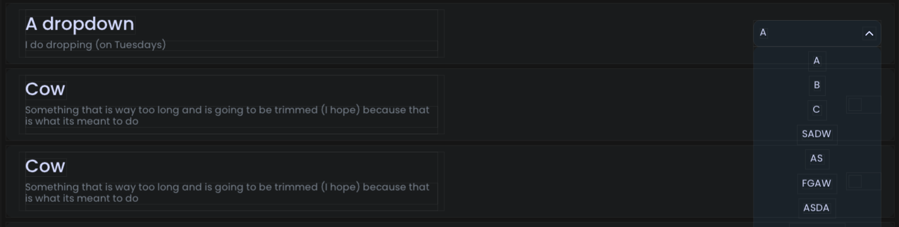

# Dropdown Option

<figure><figcaption><p>An example of what the dropdown looks like in-game.</p></figcaption></figure>

<figure><figcaption><p>An example of what the dropdown looks like in-game when it is expanded.</p></figcaption></figure>

## Example

## TODO: Redo Kotlin example with Kotlin DSL for enumerables and dropdowns

### Using an integer index



```java
@Dropdown(
    title = "My Dropdown",
    titleKey = "", // Sets the options tile translation key, default = ""
    description = "This is my dropdown", // Sets the options description, default = ""
    descriptionKey = "", // Sets the options description translation key, default = ""
    icon = "/my_dropdown.svg", // Sets the icon used for the option, default = ""
    category = "Dropdowns", // Sets the options category, default = "General"
    categoryKey = "", // Sets the categories translation key, default = ""
    subcategory = "General", // Sets the options subcategory, default = "General"
    subcategoryKey = "", // Sets the options subcategory translation key, default = ""
    options = { "HELLO", "WORLD", "ONECONFIG" }, // Recommended, default = {}
    optionsKey = { } // Allows for translating entries, default = {}
)
public static int myDropdown = 0; // 0 = "HELLO"
```



```kotlin
var myDropdown: String by radiobutton(
    name = "My Dropdown",
    defaultOption = "HELLO",
    options = arrayOf("HELLO", "WORLD", "ONECONFIG"),
    nameKey = null, // Sets the options name translation key, default = null
    description = "This is my dropdown", // Sets the options description, default = null
    descriptionKey = null, // Sets the options description translation key, default = null
    icon = "/my_dropdown.svg", // Sets the icon used for the option, default = null
    category = "Dropdowns", // Sets the options category, default = "General"
    categoryKey = null, // Sets the categories translation key, default = null
    subcategory = "General", // Sets the options subcategory, default = "General"
    subcategoryKey = null, // Sets the options subcategory translation key, default = null
    optionKeys = arrayOf(), // Sets the options translation keys, order same as options, default = arrayOf()
    stringTransformer = { it.lowercase() }, // Sets how to get the name for the option, default = { it.toString() }
)
```



### Using a custom enum class



```java
public enum MyDropdownOptions {
    HELLO,
    WORLD,
    ONECONFIG;
}

@Dropdown(
    title = "My Dropdown",
    titleKey = "", // Sets the options tile translation key, default = ""
    description = "This is my dropdown", // Sets the options description, default = ""
    descriptionKey = "", // Sets the options description translation key, default = ""
    icon = "/my_dropdown.svg", // Sets the icon used for the option, default = ""
    category = "Dropdowns", // Sets the options category, default = "General"
    categoryKey = "", // Sets the categories translation key, default = ""
    subcategory = "General", // Sets the options subcategory, default = "General"
    subcategoryKey = "", // Sets the options subcategory translation key, default = ""
    // this field cannot be present when using an enum: options = { "HELLO", "WORLD", "ONECONFIG" }, // Recommended, default = {}
    optionsKey = { } // Allows for translating entries, default = {}
)
public static MyDropdownOptions myDropdown = MyDropdownOptions.HELLO;
```



```kotlin
enum class MyRadioOptions(val displayName: String) {
    HELLO("hi"),
    WORLD("world"),
    ONECONFIG("OneConfig!"),
}

var myDropdown by radiobutton(
    name = "My Dropdown",
    defaultOption = MyDropdownOptions.HELLO,
    options = MyDropdownOptions.entries.toTypedArray(),
    nameKey = null, // Sets the options name translation key, default = null
    description = "This is my dropdown", // Sets the options description, default = null
    descriptionKey = null, // Sets the options description translation key, default = null
    icon = "/my_dropdown.svg", // Sets the icon used for the option, default = null
    category = "Dropdowns", // Sets the options category, default = "General"
    categoryKey = null, // Sets the categories translation key, default = null
    subcategory = "General", // Sets the options subcategory, default = "General"
    subcategoryKey = null, // Sets the options subcategory translation key, default = null
    optionKeys = arrayOf(), // Sets the options translation keys, order same as options, default = arrayOf()
    stringTransformer = MyRadioOptions::displayName, // Sets how to get the name for the option, default = { it.toString() }
)
```


