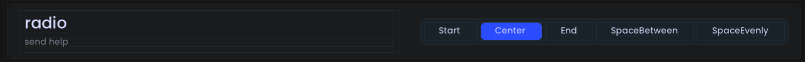

# Radio Button Option

<figure><figcaption><p>An example of what the radio button looks like in-game.</p></figcaption></figure>

## Example

## TODO: Redo Kotlin example with Kotlin DSL for enumerables and radiobuttons

### Using an integer index



```java
@RadioButton(
    title = "My Radio",
    description = "This is my radio", // Recommended, default = ""
    icon = "/my_radio.svg", // Optional, default = ""
    category = "Radio Buttons", // Recommended, default = "General"
    subcategory = "General", // Recommended, default = "General"
    options = { "HELLO", "WORLD", "ONECONFIG" } // Recommended, default = {}
)
public static int myRadio = 0; // 0 = "HELLO"
```



```kotlin
@RadioButton(
    title = "My Radio",
    description = "This is my radio", // Recommended, default = ""
    icon = "/my_radio.svg", // Optional, default = ""
    category = "Radio Buttons", // Recommended, default = "General"
    subcategory = "General", // Recommended, default = "General"
    options = ["HELLO", "WORLD", "ONECONFIG"] // Recommended, default = []
)
var myRadio = 0 // 0 = "HELLO"
```



### Using a custom enum class



```java
public enum MyRadioOptions {
    HELLO,
    WORLD,
    ONECONFIG;
}

@RadioButton(
    title = "My Radio",
    description = "This is my radio", // Recommended, default = ""
    icon = "/my_radio.svg", // Optional, default = ""
    category = "Radio Buttons", // Recommended, default = "General"
    subcategory = "General", // Recommended, default = "General"
    // this field cannot be present when using an enum: options = { "HELLO", "WORLD", "ONECONFIG" }
)
public static MyRadioOptions myRadio = MyRadioOptions.HELLO;
```



```kotlin
public enum class MyRadioOptions {
    HELLO,
    WORLD,
    ONECONFIG
}

@RadioButton(
    title = "My Radio",
    description = "This is my radio", // Recommended, default = ""
    icon = "/my_radio.svg", // Optional, default = ""
    category = "Radio Buttons", // Recommended, default = "General"
    subcategory = "General", // Recommended, default = "General"
    // this field cannot be present when using an enum: options = ["HELLO", "WORLD", "ONECONFIG"]
)
var myRadio = MyRadioOptions.HELLO
```




Your field can be typed with an integer, or with an enum.

When using an integer, you NEED to provide the `options` property, otherwise it is not supported when using an enum.

