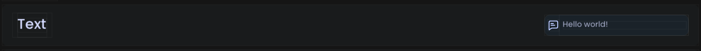

# Text Option

<figure><figcaption><p>An example of what the text option looks like in-game.</p></figcaption></figure>

## Example



```java
@Text(
    title = "My Text",
    description = "This is my text", // Recommended, default = ""
    icon = "/my_text.svg", // Optional, default = ""
    category = "Text", // Recommended, default = "General"
    subcategory = "General", // Recommended, default = "General"
    placeholder = "Name..." // Optional, default = "polyui.textinput.placeholder"
)
public static String myText = "";
```



```kotlin
var myText: String by text(
    title = "My Text",
    def = "", // Sets option's default value. Recommended, default = ""
    description = "This is my text", // Recommended, default = ""
    icon = "/my_text.svg", // Optional, default = ""
    category = "Text", // Recommended, default = "General"
    subcategory = "General", // Recommended, default = "General"
    placeholder = "Name..." // Optional, default = "polyui.textinput.placeholder"
)
```


