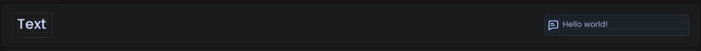

# Text Option

<figure><figcaption><p>An example of what the text option looks like in-game.</p></figcaption></figure>

## Example



```java
@Text(
    title = "My Text",
    def = "", // Sets option's default value. Recommended, default = ""
    titleKey = "", // Sets the options tile translation key, default = ""
    description = "", // Sets the options description, default = ""
    descriptionKey = "", // Sets the options description translation key, default = ""
    icon = "", // Sets the icon used for the option, default = ""
    multiline = false, // Allows multiline text, default = false
    category = "General", // Sets the options category, default = "General"
    categoryKey = "", // Sets the categories translation key, default = ""
    subcategory = "General", // Sets the options subcategory, default = "General"
    subcategoryKey = "", // Sets the options subcategory translation key, default = ""
    placeholder = "", // Sets the options placeholder, default = ""
    placeholderKey = "polyui.textinput.placeholder" // Sets the options placeholder translation key, default = "polyui.textinput.placeholder"
)
public static String myText = "";
```



```kotlin
var myText: String by text(
    name = "My Text",
    def = "", // Sets option's default value. Recommended, default = ""
    nameKey = null, // Sets the options tile translation key, default = null
    description = null, // Sets the options description, default = null
    descriptionKey = null, // Sets the options description translation key, default = null
    icon = null, // Sets the icon used for the option, default = null
    multiline = false, // Allows multiline text, default = false
    category = "General", // Sets the options category, default = "General"
    categoryKey = null, // Sets the categories translation key, default = null
    subcategory = "General", // Sets the options subcategory, default = "General"
    subcategoryKey = null, // Sets the options subcategory translation key, default = null
    placeholder = null, // Sets the options placeholder, default = null
    placeholderKey = "polyui.textinput.placeholder", // Sets the options placeholder translation key, default = "polyui.textinput.placeholder"
)
```


