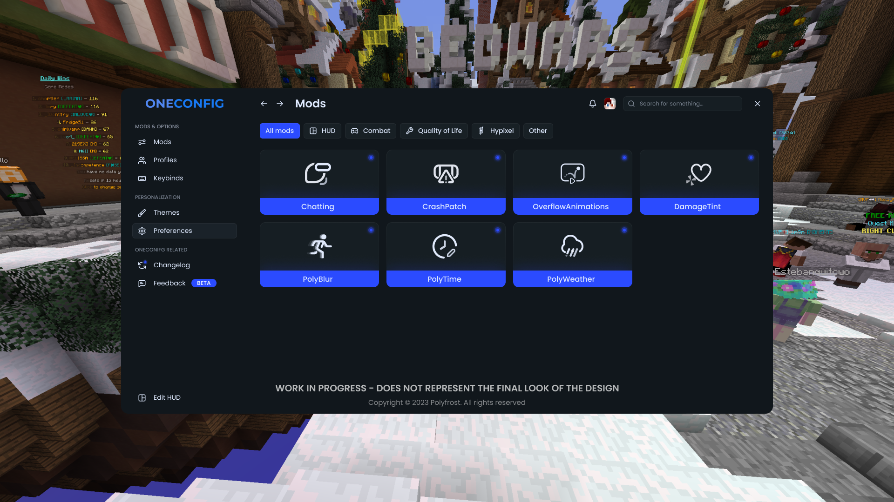

# Modding Basics

This page will serve as a basic guide to getting started with modding using OneConfig's example mod.

Minecraft mods are most commonly added into the game using a **loader**, the most popular of which are [Fabric](https://fabricmc.net) and [Forge](https://files.minecraftforge.net/). Forge is popular for older Minecraft versions, while Fabric is considered the main platform for vanilla compatible modding in 1.16+. The term 'mod' refers to a modification of the Minecraft game.&#x20;

Since Minecraft is in Java, most of its mods are as well. You may also find mods written in [Kotlin](https://kotlinlang.org/), a programming language designed to be compatible with the JVM (Java Virtual Machine). Some developers find Kotlin easier to use than Java. **OneConfig includes Kotlin so you shouldn't include it yourself in your mod if you wish to use it.** However, OneConfig itself mostly uses Java over Kotlin.

**You will need some basic knowledge of programming to effectively develop Minecraft mods.** But don't worry! Java is reasonably easy to pick up, as it is an **object-orientated programming (OOP)** language with a reasonably easy-to-understand syntax. However, you should still watch a few tutorials and get your feet relatively wet before diving into Minecraft modding.

### Step 1: Installing IntelliJ IDEA

For this tutorial, we are going to use the OneConfig Example which can be found [here](https://github.com/Polyfrost/OneConfigExampleMod). In this guide, we are going to use [JetBrains IntelliJ IDEA](https://www.jetbrains.com/idea/) as our **integrated development environment (IDE)**, as this is the preferred choice for most Minecraft mod developers.

Firstly, head to their [**downloads page**](https://www.jetbrains.com/idea/download/) and download IntelliJ IDEA for your operating system or platform. We recommend the 'Community Edition' for casual developers. It's free and probably has all the features you'll need. After downloading it, follow the prompts to get it installed.

Once that has been downloaded, you may want to open up your files browser and create yourself a directory for all your mods (e.g `C:/Users/Bob/Documents/Minecraft Mods/`). This is just a quality of life step, so if you wish, you can ignore it and do as you wish.

### Step 2: Creating the Project

Now that you have installed IntelliJ, you should be ready to clone the project. Open up IntelliJ and you should be greeted with a screen a bit like this (after accepting the terms):

.png>)

Once you're at this screen:

* Click the **Get from VCS** button in the top right.
* Go to **Repository URL**.
* Check that **Version Control** is set to **Git**.
* Set the directory to the root folder you made earlier for mod development.
* In the **URL** box, input `https://github.com/Polyfrost/OneConfigExampleMod`.
* At the end of the Directory box, add the name of your mod. In this tutorial, it will be called `ExampleMod`.

It should now look something like this:

.png>)

If that all looks good, go ahead and click the **Clone** button in the bottom right.

### Step 3: Project Setup

Now, you will need to set up your **Java Development Kits (JDKs)** to get started with coding. These are used to run your code and Minecraft, and allow you to build your projects into distributable java executable binaries (commonly known as JARs).

#### GRADLE JVM

Firstly, hit **Ctrl+Alt+S** to open Settings, and go to **Build, Execution and Deployment** **> Build Tools > Gradle** from the left sidebar menu. At the bottom right of this screen, there will be a dropdown list button entitled **Gradle JVM.** Click it to open the dropdown list menu.

* Press **Ctrl+Alt+S** to open Settings.
* Go to **Build, Execution and Deployment** **> Build Tools > Gradle** from the left sidebar menu.
* At the bottom of this screen, look for a dropdown list button labelled **Gradle JVM**. Open the dropdown list.
* Now, click **Download JDK** and set the **Version** to **17 or above** on the popup that appears. Don't change anything else — just hit **Download**. Once finished, set this new JVM as the **Gradle JVM** and click **Apply** to complete the changes.

#### PROJECT JVM

* Press **Ctrl+Alt+Shift+S** to open Project Settings.&#x20;
* Go to **Project Settings > Project**.
* Open the **SDK** dropdown menu.
* Again, go to **Add SDK** then **Download JDK**. This time, **choose 1.8 as the version** and press **Download**. Once finished, set this new JVM as the **Project SDK**. Click **Apply** to set the changes.
* Again, go to **Add SDK and then Download SDK**. This time, choose **1.8 as the version** and press **Download**. Once that has finished, set that new JVM as the **Project SDK** and click **Apply** to set the changes.I

.png>)

In case you weren't sure, here is an example of the download dialogue box:

 (1).png>)

### Step 4: Reloading and Building

Now you have your JDKs set up, you can go ahead and close all those windows to go back to the main IDE. Click the little green hammer in the top right of your screen, and wait for it to download all the necessary libraries and Minecraft itself. Once that's done, you need to run `genSources` to decompile the game so it's easier to view. The easiest way to do this is to **Hit Ctrl 3 times**, then type `gradle genSources` to decompile it.

Next, **hit control 3 times again**, and type `gradle genintellijruns`. Run that as well to generate the run scripts for Minecraft.


**Note:** You might need to restart IntelliJ for the run to show up.


### Step 5: Run Your Mod

**You are now ready to run your mod for the first time!** Make sure that **Minecraft Client** is selected, and click the play button. With some luck, your game should launch.


If you encounter any issues, feel free to join our [Discord server](https://polyfrost.cc/discord) and ask.

